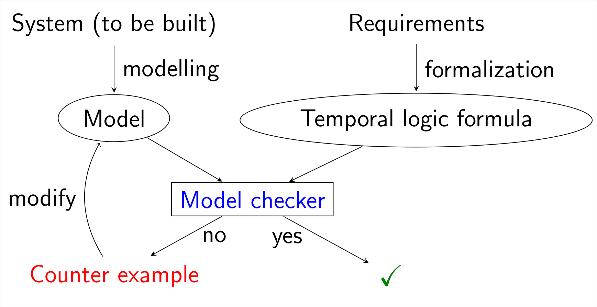
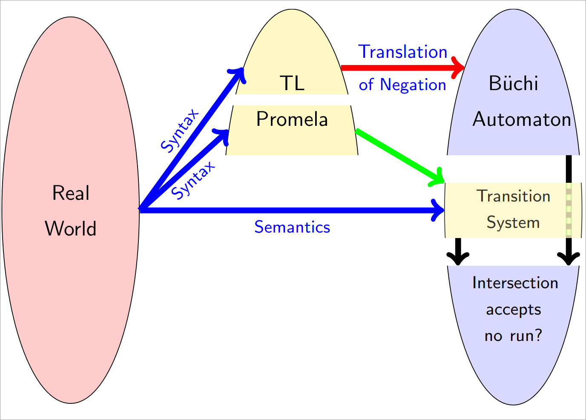

# Rigorous Process - 2024 Summer

**Validation** is the proof, that a system meets its requirements.

**Verification** is the proof, that the program is working mathematically correct.

<!-- TODO: Real world examples of Verification -->

## Design by Contract

Every publicly accessible method defines pre- and postconditions.
The client calls a method, the supplier provides the method.

> **IF** a client runs the method in situations that satisfy the precondtion -
> **THEN** the supplier will make sure that the method execution delivers a state that satisfies the postcondition

### Class context

Class invariant (assertion involving the instance variables) must be satisfied at all times.

- After the constructor execution
- Before and after execution of every public method

> Private methods can violate the invariant!

#### Inheritance

When a class gets extended, the overridden methods cannot demand more but must at least provide the same.
The client only knows the general implementation of the superclass,
so they need to be able to assume the same outcome when satisfying the precondition.

This means:

- The **preconditions** of an overridden method must be the **same or weaker** than the super methods
- The **postconditions** of an overridden method must be the **same or stronger** than the super methods
- The **class invariant** can be the **same or stronger** as the superclass ones

### Hoare Logic

Hoare Triple:

- Precondition $\phi$
- Program P
- Postcondition $\psi$

> If program $P$ is started in a state satisfying $\phi$ and if it terminates, then the finish state will stisfy $\psi$

Procedure:

- down-to-top: Postcondition must lead to precondition when executing all statements
- in loops:
  - **loop Guard** (Abbruchbedingung) must be true in loop, after loop $\neg$ guard must be true
  - **loop Invariant** is true:
    - before loop
    - begin of every loop execution
    - end of every loop execution
    - **only true when in loop**
- in if/else: every branch has a guard that holds in the branch itself

> For **total correctness** termination has to be proven !

## Model checking

<!-- TODO: Difference Model Checking vs. Hoare Logic / Design by contract -->

### Kripke structure

A Kripke structure consists of a 4-tuple:

$$
M = (S, S_0, R, L)
$$

- $S$ is a set of states
- $S_0 \subseteq S$ is a set of the initial states
- $R \subseteq S \times S$ are the transitions allowed for each state
- $L$ gives the set of propositions allowed in each state

Higher-level language models (e.g. Promela) can be translated to Kripke structures.

### LTL - Linear Temporal Logic

Connection of atomic propositions through boolean and temporal operators.

- Boolean connectives:
  - NOT: $\lnot$
  - AND: $\land$
  - OR: $\lor$
  - Implies: $\implies$
  - Equivalence: $\iff$
- Temporal operators:
  - Next: $X$ = holds in next state
  - Globally / Always: $G$ = holds always
  - Finally / Eventually: $F$ = holds sometime in the future
  - Until: $U$ = x holds until y holds, y will eventually hold

### CTL - Computational Temporal Logic

<!-- TODO -->

## Spin

## Event-B

<!-- TODO -->
