# Software Testing - Summer 2024

## Software Testing Process

### Steps

1. **Analysis**: Analyze specification and software implementation
1. **Identify Test Coverage Items**: Criteria the tests address
1. **Identify Test Cases**: Specify data required to address test coverage items (TCI)
1. **Test Design Verification**: Review test cases to ensure every TCI has been covered
1. **Test Implementation**: Implement using test tool library
1. **Test Execution**: Execute tests using selected input data values
1. **Review Test Results**: Examine test results for failures

### Test Cases Template

| ID  | TCI  | Inputs (multiple columns) | Expected Results (return value) |
| --- | ---- | ------------------------- | ------------------------------- |
| ID  | List | Values                    | Values                          |

> For error values the ID and the error value get marked with a \*

## Black Box Testing

Testing for specification: does the tested code generate correct results?

### Equivalence Partitions

1. **Analysis**: Identify natural ranges & specification-based ranges
   (Specification-based ranges declare which range changes the result)
1. **Identify Test Coverage Items**: TCI for each partition of each input / output parameter
1. **Equivalence Value for each TCI**: Identify middle value of short ranges or convenient value for long ranges
1. **Identify Test Cases**: Select first uncovered TCI,
   indicate [duplicates] when all TCIs of input are covered or result is already covered,
   last Test Cases cover error partitions, indicated with \*
1. **Test Design Verification**: Check if all TCIs are covered

#### Examples

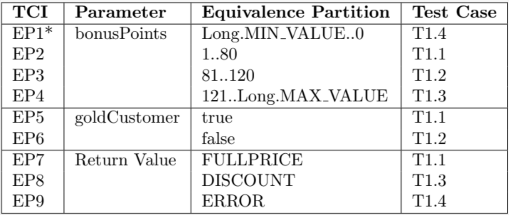

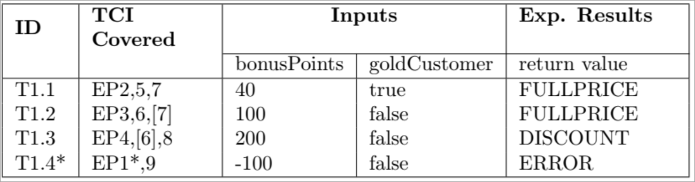

### Boundary Value Analysis

1. **Analysis**: Same as with EPs
1. **Identify Test Coverage Items**: Each TCI covers one boundary value (min or max)
1. **Identify Test Cases**: Same as with EPs

#### Examples

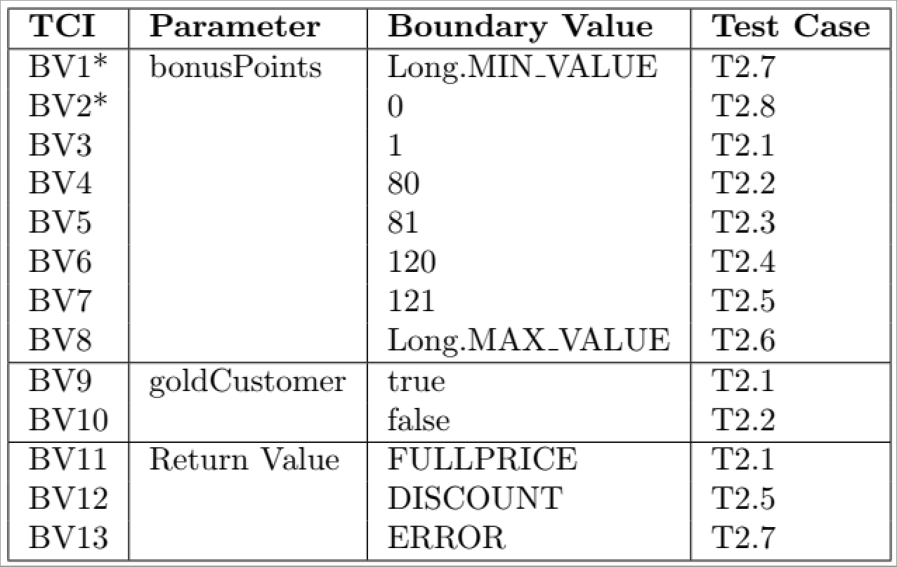

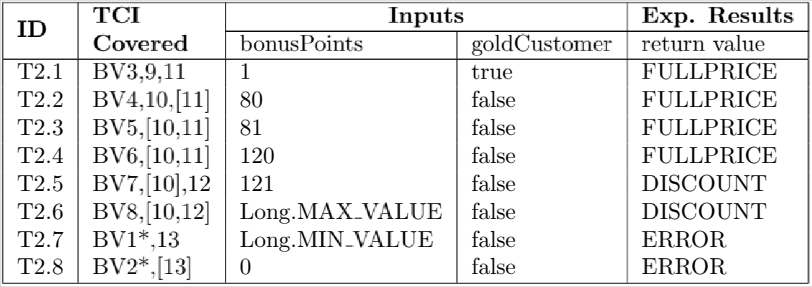

### Decision Table

1. **Analysis**: Create boolean expressions for each non-error partition
   1. Identify the boolean expressions
   1. Fill decision table
   1. Remove impossible columns
   1. Fill effect / return value
   1. Verify each rule
1. **Identify Test Coverage Items**: Each rule is a TCI
1. **Identify Test Cases**: Each rule has a candidate test case, duplicates get removed
1. **Test Design Verification**: Fill TCI table, check for duplicates, every TC covers at least 1 TCI

### Examples

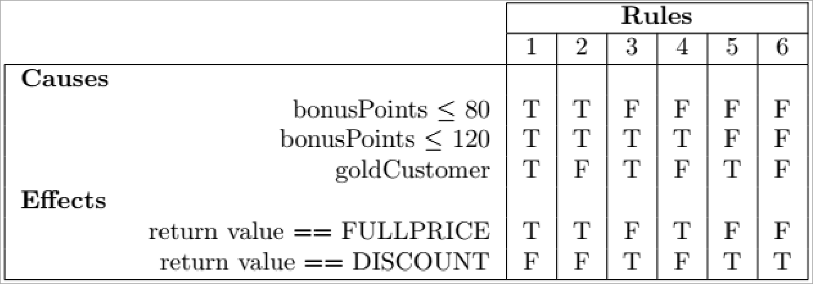

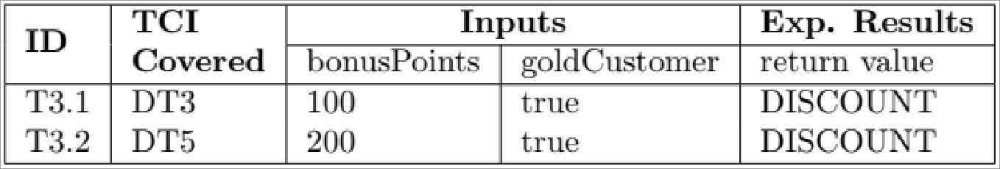

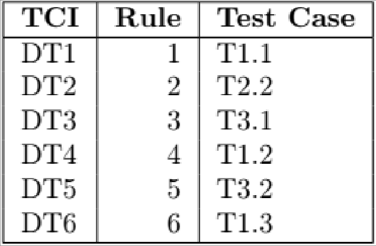

## White Box Testing

Testing the implementation: do valid results get generated when executed?

### Statement Coverage

1. **Analysis**: Run existing tests, check JaCoCo coverage report for missed statements
1. **Identify Test Coverage Items**: Create TCI to reach uncovered statement
1. **Identify Test Cases**: Create TC for every TCI
1. **Test Design Verification**: Complete TCI table, remove duplicates, every TCI must cover at least 1 TC

### Examples

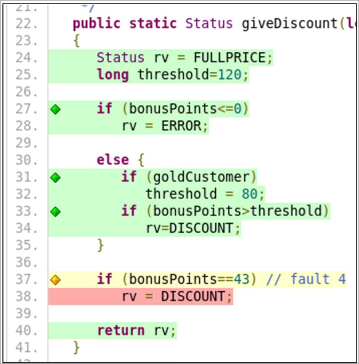

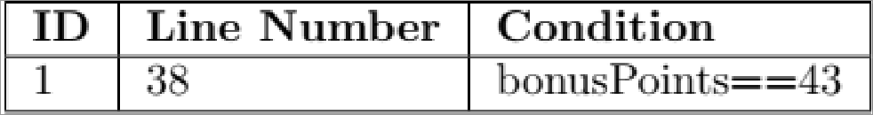

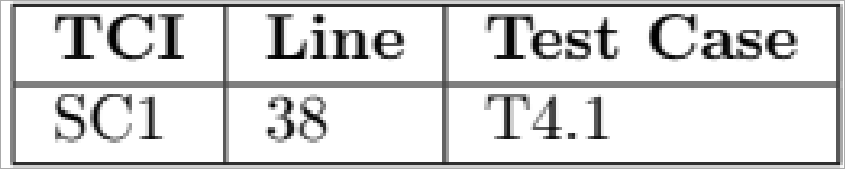

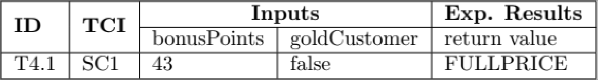

### Branch Coverage

1. **Analysis**: Run existing Tests, check JaCoCo report for missed branches
1. **Continue as with Statement Coverage**

### Examples

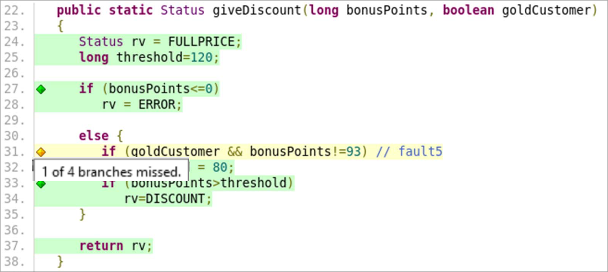

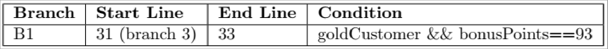

> After implementing Statement an Branch Coverage Tests check JaCoCo report!

## Object Oriented Testing

## Application Testing

## Test Automation

## Random testing

A large number of inputs gets selected randomly, approximates to exhausive testing.

- Exercises program, demonstratest that it does not crahs
- Poor distribution of inputs, as it doesn't respect partitions
- Can't tell if results are correct -> too many test

1. **Analysis**:
1. **Identify Test Coverage Items**:
1. **Identify Test Cases**:
1. **Test Design Verification**:
1. **Test Implementation**:
1. **Test Execution**:
1. **Review Test Results**:
