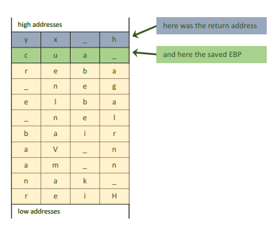
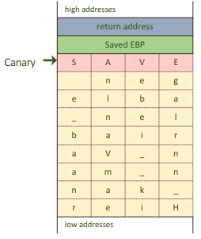
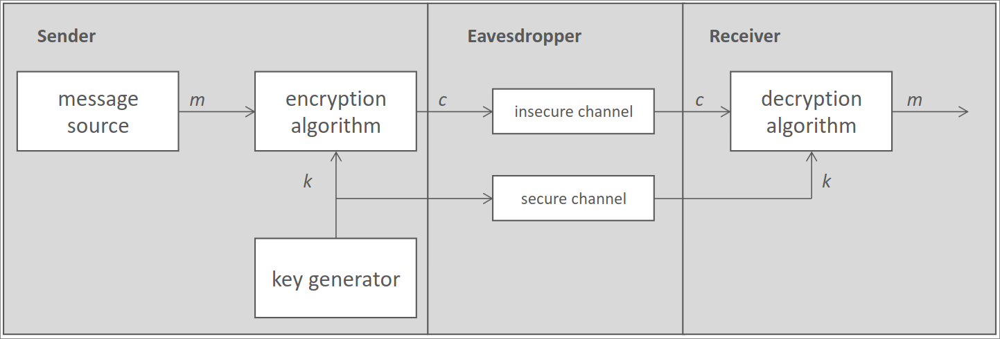
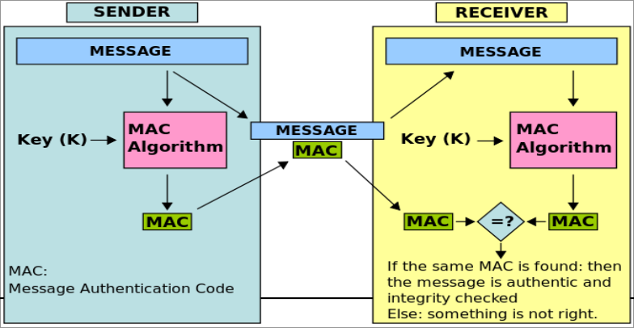
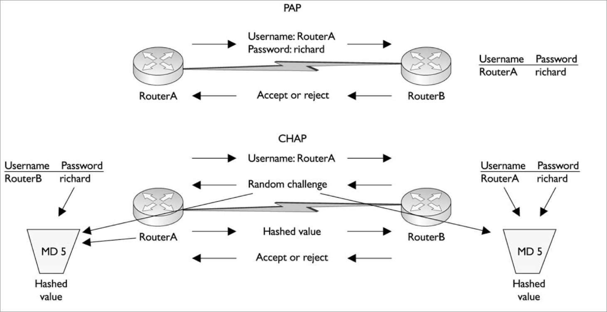

# Secure Programming - Summary

## General

### Security Goals

The goals of protection, which secure systems should achieve, are:

1. **Confidentiality** Data must be kept confidental, stored encrypted and provided only to authorized clients
1. **Integrity** Input validation, parity bit checking, cyclic redundancy check, cryptographic checking
1. **Availability** "Measures of Nines", f.e. _four nines ==_ $99.99\%$ availability
1. **Non-repudiation**
1. **Authenticity**
1. **Privacy**

#### Other requirements

**Authentication requirements**:
Validate an entities claim = verify the legitimacy and validity of the identity claim

**Authorization requirements**:
Confirm that an authenticated entity has the needed rights to perform the requested action

**Auditing / logging requirements**:
Logging message has to answer `who`, `what`, `where` and `when`

**Session management requirements**:
For role-based-access-management and user interaction features

**Error and Exception management requirements**:
Exceptions have to be handled by the application,
error messages must only reveal the needed information

**Configuration parameters management requirements**:
Software configuration parameters have to be protected from manipulation

**Sequence and timing requirements**:
Design flaws in timing or sequencing can lead to race conditions or check / time of use attacks

**Archiving requirements**:
Exist for reasons of business continuity or as a regulatory requirement

**Deployment environment requirements**:
Might affect security requirements

### Security Design Principles

- **Least Privilege**: grant only minimum necessary rights needed for the shortest duration possible
- **Seperation of duties**: prevent fraud and errors by dividing tasks and privileges for specific business processes
- **Defense in depth**: layer security defenses
- **Fail secure**: When a system fails, make it fail securely
- **Economy of mechanism**: highly complex sytems are more likely to have security vulnerabilities
- **Complete mediation**: require access checks each time a subject requests access to an object
- **Open design**: security shouldn't depend on the design but on keys and passwords
- **Least common mechanism**: avoid having multiple subjects sharing mechanisms to grant access to a resource
- **Psychological acceptability**: Resources should still be easily accessible to prevent users
  from disabling security mechanisms
- **Leveraging existing components**: reuse existing components to decrease the introduction of new vulnerabilities
- **Weakest link**: Attackers are more likely to attack weak spots than fortified components
- **Single point of failure**: a _SPOF_ can make the application unavailable, can be avoided by using redundancy

## Initialization

### Safe Initialization / System Environment

_Environment variables_ can be accessed by written code and potentially be misused / introduce security flaws.

_Solution_: Sanitzing **PATH** and **IFS** variables.

- **PATH**: locate executables in the system
   - never include relative paths
   - force the setting of the PATH environment variable to only needed values
- **IFS**: used by many shells to determine which character seperates command-line arguments
   - should be set to something sane (e.g. space, tab, newline)

### Authorization on Windows

#### Access Management

Windows manages access rights in an _Access Control List_ saved in security-descriptors in the _Master File Table_

### Windows

- **SID**: system wide unique security ID
- **DACL**: discretionary ACL = list of ACEs (Access Control Elements with allow/deny)
- **SACL**: system ACL, specifies operations to log and audit

#### Privilege Restriction in Windows through Access Tokens

Every thread / process started in the user context has a copy of the access token that's been created after user login.
Processes that shouldn't be able to access some functionality only get required rights / restricted tokens that
have been created through the `CreateRestrictedToken` function:

- removes privileges from a token
- applies the _deny-only_ attribute to SIDs
- specifies a list of restricting SIDs

_Access Tokens_ contain:

- Security identifier (SID) of the user & user groups
- SID of logon session
- list of privileges
- owner SID
- TSID for primary group
- default DACL
- access token source
- access token primary or impersonation
- optional list of restricting SIDs
- impersonation levels
- statistics

## Input Validation

Safe assumptions are essential:

- input is guilty until proven otherwise
- prefer rejecting data to filtering data
- policy decisions based on a "default deny" rule
- do not accept commands from the user unless you parse them yourself
- perform data validation at input points and component level

### Rules of Input Validation

1. **Define what you expect**:
   What Purpose, Format, Size for the requested input, which conversion is done?
1. **Canonicalize (Seperation of Concerns)**
1. **Check that input meets expectations**
1. **Manipulate input or drop it if expectations aren't met**

### Input Validation Problems

#### URL

1. **Unsafe character encoding**:
   Multiple encoding of unsafe characters may lead to ambiguities (Mehrdeutigkeit) in URLs -
   this can lead to potentially undefined states.
1. **NULL-termination of C-strings**:
   can be encoded anywhere in the URL #

#### Strings

Common Errors:

- unbounded stream from stdin $\rightarrow$ limit size
- unbounded string copy and concatenation $\rightarrow$ dynamic allocation
- extracting characters from `cin` into character array $\rightarrow$ use maximum buffer size
- writing exactly as many characters than space causes buffer overflow, because strings are null-terminated in C (`\0`)

When more data is written than allowed:

- saved EBP and return address are overwritten (in C and C++)
  
- return address can be modified to point to a malicious program or just destroyed to produce DOS (Denial of service)

Solutions:

- **Canaries**:
  
   - _canary_ value at the end of allocated memory
   - when destoryed $\rightarrow$ buffer overflowed
   - _BUT_: DOS still working
- **Bounds checking**:
   - compiler-based technique
   - adds run-time bounds information for each allocated block of memory
   - checks pointers against run-time bounds during run-time
- **AddressSanitizer**: (implemented in clang or gcc)
   - detects all kinds of memory-corruption bugs
   - Downside: performance overhead
   - checks for example: heap use after rfree, heap and stack buffer-overflow
- **OS-based-defenses**:
   - Non-executable stack
      - mark data in stack as non-executable
   - Adress-Space-Layer-Randomization (Unix and Win)
      - randomize address space
      - addresses can only be guessed
   - Sandboxes and compartment based OS extensions
      - execute vulnerable components in protected areas

Also always use safe options during coding:

- `printf(string)` $\rightarrow$ `printf("%s", string)`
- `fprintf(stderr, string)` $\rightarrow$ `fprintf(stderr, "%s", string)`
- `snprintf(puffer, sizeof(puffer), string)` $\rightarrow$ `snprintf(puffer, sizeof(puffer), "%s", string)`

#### Integer

Errors:

- Integer Overflow
- Sign Errors (Signed or Unsigned)
- Truncation Errors (Kürzungsfehler)

Mitigation strategies:

- Range checking
- Strong typing
- Compiler options
- Arbitrary precision arithmetic
   - GNU Multiple Preciison Arithmetic Library (GMP)
   - Java BigInteger

#### Additional Topics - Input Validation

- Validating Email-Addresses
   - check against RFC 822
- Cross Site Scripting
   - Refuse to accept anything that look like HTML
   - Escape special characters
- SQL-Injection
   - Restrict user input to the smallest character set possible, refuse anything else
   - Escape character that have special significace to SQL (f.e. `;`, `=`, `""`)

> **ALWAYS**: default deny

## Randomness

Used for creation of keys, nonces, initialisation vectors, salts, canaries, ...

Randomness in computers:

- Get data from an unpredictable hardware-source
- Use numbers seed to create much larger number or subsequent pseudo-random-numbers
- from real world
   - quantum vacuum fluctuation
   - radioactive decay
   - photonoic emission
   - outcome of qunatum measurement of equal probability

### Security considerations

Security issues with randomness:

- Weak generation:
   - WPS on cheap WIFI-APs
   - Weak generation in programming (`rand()` in C & C++)
- Manipulation:
   - insecure standards (NSA manipulated RSA RNG-standard)
   - manipulation of RNG in OS
      - through malware
      - hardware RNG manipulation
- Special case: virtual machines
   - source of entropy (Informationsdichte) not under control

> Encryption needs a key of _good_ randomness.
> Non randomness of RNG create most weaknesses of encryption.

### Possible RNGs

- Noncryptographic pseudo RNGs
   - attacker could predict the output of such generators
- Cryptographic pseudo-random number generators (CPRNGs)
   - single secure seed $\rightarrow$ generate as many unguessable numbers as necessary
   - secure for most use cases, but has to be **securely seeded**
   - Sources:
      - random infrastructure in OS:
         - _Unix_: `/dev/random`
         - _Windows_: `CryptGenRandom()`
      - CPRNG systems like `cprng-aes` or `openssl`
      - exteernal sources of random-numbers if applicable
- Entropy harvesters
   - try to gather entropy from other sources and present it directly, therefore sometimes _true_ RNG
   - expected to bes seucre under most circumstances
   - incredibly slow to produce data
   - entropy data has to be postprocessed with cryptographic method to remove statistical bias
- Quantum RNGs
   - quantum mechanical random processes to generate random numbers

## Encryption Techniques

**Kerckhoff-Principle**: Quality of Cipher is only dependent on the quality of the secret.

### Symmetric Encryption

Symmetric encryption by using a single key for encrypition and decryption.

_Private-Key Encryption_

Cipher Types:

- **Stream ciphers**:
  Substitute data bit by bit or byte by byte with pseudo-random data (_SNOW 2.0_, _MUGI_)
- **Block ciphers**:
  Encrypting fixed size chunks of data (_AES_)

> General recommendation: always use **AES**

Key length should be _128+bit_ - secure enough for a long time.
If RNG isn't trusted, longer keys have more entropy and are therefore more secure (but slower).

Current Cipher mode of choice is **GCM** (RFC 4106), recommended by _NIST_ and offering integrity.

#### Integrity through hashing

To add integrity to a message, add message hash to communication. Receiver decrypts message and creates hash
$\rightarrow$ when hashes match, message wasn't changed

Requirement for hash-functions:

- **One-wayness**: can't compute plaintext value from generated hash
- **Noncorrelation**: Input bits and output bits shouldn't correlate
- **Collision resistance**: should be infeasible to find two plaintext values that produce (roughly) the same hash

>Recommended hashing algorithm: **SHA (256+)**

##### MAC - Message authentication codes

Hash functions that take a message and a secret key as input.
The output can only be produced whithout posessing the secret key.

Possible MACs: OMAC, CMAC, HMAC

### Asymmetric Encryption

Key distribution is constant source of insecurity.
Solution for this problem:

1. Every person being part of the communication creates a pair of keys for en- & decryption.
1. Personal encryption key get's shared between all members.
1. Encryption of personal messages can be done by anyone, decryption can only be done with private key.

This is called **Public Key Cryptogarphy**, where $K_e$ is the public and $K_d$ is the secret key.

#### RSA

1. Key Generation:
   - choose $p$ & $q$, $n = p * q$, $\phi(n) = (p-1)(q-1)$
   - choose $1 < e < \phi(n)$, $gcd(e, \phi(n)) = 1$
   - choose $d$, so that $(d*e) mod\ \phi(n) = 1$
1. Encryption: $C = P^e mod\ n$
1. Decryption: $P = C^d mod\ n$

The pair $(n, e)$ is shared as the public key.

#### Security considerations

Types of attacks:

- derive $K_d$ from $K_e$ (when $N$ from RSA can be factorized) $\rightarrow$ RSA is as secure as factorization
- derive $m$ (message) from $c$ (ciphertext) $\rightarrow$ **RSA-Problem**
- known plaintext attacks
- timing attacks
- sidechannel attacks

#### Integrity

Integrity is added through hashes:

1. A function pair is determined: $S$ for hashing with $K_d$, $V$ for verfiying the hash with $K_e$
1. Sender adds hash of $S(M,K_d)$ to encrypted message $C$
1. Receiver proofs that the sender knows the private key through $V(C,S,K_e)$

This is called **Digital Signature**.

#### Digital Signature

Signing Function:

1. hash plaintext message
1. encrypt hash with private key $K_d(p_1)$
1. message with public key $K_e(p_2)$
1. send encrypted message and encrypted hash to receiver
1. decrypt message with $K_d(p_2)$, calculate hash
1. decrypt transmitted hash with $K_e(p_1)$
1. compare results

Keys & Secrets can be exchanged through the **Diffie-Hellman Keyexchange**:

- choose prime numbers $p$ and $g$
- Alice and Bob choose their own private keys $x$, compute public keys $X = g^x mod\ p$
- Share $X(Alice)$ and $X(Bob)$, compute secret $s = X^x mod\ p$

#### Usage

Private Key-Encryption is about 1000 times slower than symmetric encryption.
It's mostly used to encrypt symmetric keys, which then can be transferred over insecure channels.

## Authentication

Proof, that you are the one that you claim to be.

1. **Things you know**: passwords, PIN, passphrase, ...
1. **Things you have**: ATM cards, ...
1. **Things you are**: fingerprints, voice analysis, ...

Requirements:

- Practicality of deployment
- Usability
- Use across applications
- Patents
- Efficiency
- Security
- ...

### Popular technologies

- Password
- PKI
   - SSL certificate based checking
   - public key exchange
- Directory based mechanisms
   - LDAP
   - Kerberos
- Bimoetric authentication

#### Password checking

Never send unencrypted passwords over the internet!

- agree on hashing / encryption algorithm prior to password exchange
- use zero knowledge mechanisms, e.g. Fiat-Shamir-Feige:
   - $N = p * q$
   - $v = s^2 mod\ N$ (Pair **(v,N)** is the public key of A)
   - $x = r^2 mod\ N$, send $x$ to B
   - B sends bit to A, if bit == 0 respond $r$, else $y = (r * s) mod\ N$
   - B checks response by calculating it reverse

#### PKI = Public Key Infrastrucutre

Consists of:

- **Certification Authority (CA)**: issues and signs certificates
- **Registration Authority (RA)**: guarantees public key belongs to specific entity
- **Directory Service**: distributes certificates and CRLs
- **Validation Authority (VA)**: real-time validation of certificates

Gets implemented by the Needham-Schroeder protocol:

- authentication server communicates with the server
- the server authenticates itself and the client it's communcating
- authentication through secret and symmetric keys

#### Directory services

Directory services store personal information and can also be used to store authentication credentials.
The most poular protocol is **LDAP**.

#### Kerberos

Client has to authenticate with an authentication server first.
Next the ticket granting server grants the client a ticket, which he can use to communicate with a server
in a certain timerframe.

#### Single-Sign-On

SAML-Protocol is used to exchange information between policy-enforcement- and policy-decision-points.

XACML is used to specify access policies.

Alternatives: OAuth and OpenID

### Programming

Secret information has to be kept out of source code.

- changing secret information would be difficult
- easy to attack by anyone who has the binary

Alternatives:

- Ask the user who is starting the binary $\rightarrow$ are access rights sufficient
- Store secret in seperate file or database and secure that
- Encrypt and ask user or OS for key
- Use existing external mechanisms for authentication (LDAP, Kerberos, ...)
- Use already existing credentials
- Use hashing wherever useful $\rightarrow$ hashing is irreversible, salted hash is enough for authentication

### Secret storing

During execution, the secret can be found / stored in CPU, RAM and hard disk.

After execution, the CPU storage is flushed, but the RAM storage has to be overwritten.

After system shutdown, only the hard disk is a possible storage, but the RAM could be attacked by cold boot attacks.

To be safe, make sure to **delete and overwrite memory** after secrets are not needed anymore.
Also try to lock the address-space during execution,
try to use further OS-based memory and process protection technologies.

> If your OS is broken, everything is broken!
