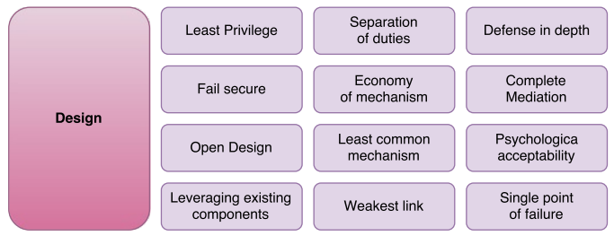
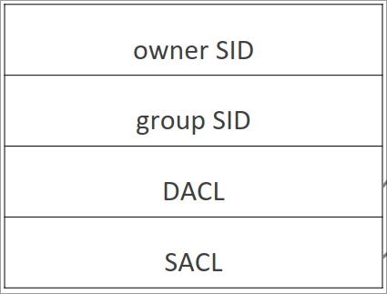

# Secure Programming - Summary

## General

### Security Goals

The goals of protection, which secure systems should achieve, are:

1. **Confidentiality** Data must be kept confidental, stored encrypted and provided only to authorized clients
1. **Integrity** Input validation, parity bit checking, cyclic redundancy check, cryptographic checking
1. **Availability** "Measures of Nines", f.e. $four\ nines == 99.99\%$ availability
1. **Non-repudiation**
1. **Authenticity**
1. **Privacy**

#### Other requirements

**Authentication requirements**:
Validate an entities claim = verify the legitimacy and validity of the identity claim

**Authorization requirements**:
Confirm that an authenticated entity has the needed rights to perform the requested action

**Auditing / logging requirements**:
Logging message has to answer `who`, `what`, `where` and `when`

**Session management requirements**:
For role-based-access-management and user interaction features

**Error and Exception management requirements**:
Exceptions have to be handled by the application,
error messages must only reveal the needed information

**Configuration parameters management requirements**:
Software configuration parameters have to be protected from manipulation

**Sequence and timing requirements**:
Design flaws in timing or sequencing can lead to race conditions or check / time of use attacks

**Archiving requirements**:
Exist for reasons of business continuity or as a regulatory requirement

**Deployment environment requirements**:
Might affect security requirements

### Protection Strategies

### Security Design Principles

- **Least Privilege**: grant only minimum necessary rights needed for the shortest duration possible
- **Seperation of duties**: prevent fraud and errors by dividing tasks and privileges for specific business processes
- **Defense in depth**: layer security defenses
- **Fail secure**: When a system fails, make it fail securely
- **Economy of mechanism**: highly complex sytems are more likely to have security vulnerabilities
- **Complete mediation**: require access checks each time a subject requests access to an object
- **Open design**: security shouldn't depend on the design but on keys and passwords
- **Least common mechanism**: avoid having multiple subjects sharing mechanisms to grant access to a resource
- **Psychological acceptability**: Resources should still be easily accessible to prevent users
  from disabling security mechanisms
- **Leveraging existing components**: reuse existing components to decrease the introduction of new vulnerabilities
- **Weakest link**: Attackers are more likely to attack weak spots than fortified components
- **Single point of failure**: a _SPOF_ can make the application unavailable, can be avoided by using redundancy

## Initialization

<!-- 2-initialization -->

### Windows

- **SID**: system wide unique security ID
- **DACL**: discretionary ACL = list of ACEs (Access Control Elements with allow/deny)
- **SACL**: system ACL, specifies operations to log and audit

#### Privilege Restriction in Windows through Access Tokens

Every thread / process started in the user context has a copy of the access token that's been created after user login.
Processes that shouldn't be able to access some functionality only get required rights / restricted tokens that
have been created through the `CreateRestrictedToken` function:

- removes privileges from a token
- applies the _deny-only_ attribute to SIDs
- specifies a list of restricting SIDs

_Access Tokens_ contain:

- Security identifier (SID) of the user & user groups
- SID of logon session
- list of privileges
- owner SID
- TSID for primary group
- default DACL
- access token source
- access token primary or impersonation
- optional list of restricting SIDs
- impersonation levels
- statistics

## Input Validation

## Randomness

## Symmetric & Asymmetric Encryption

## Authentication
