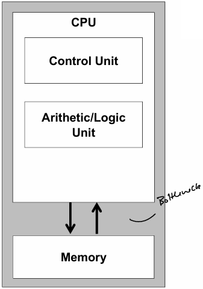
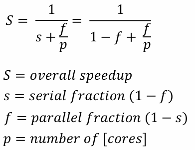
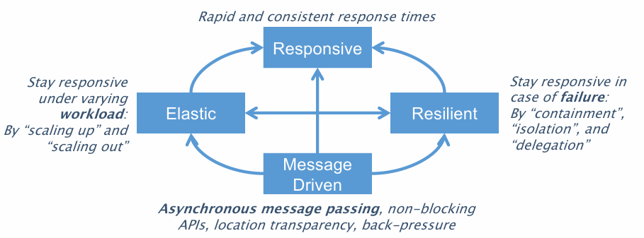
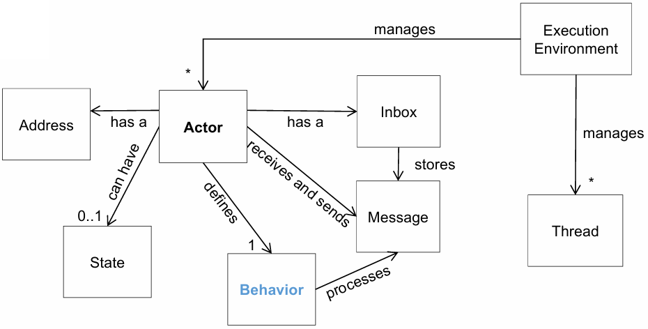
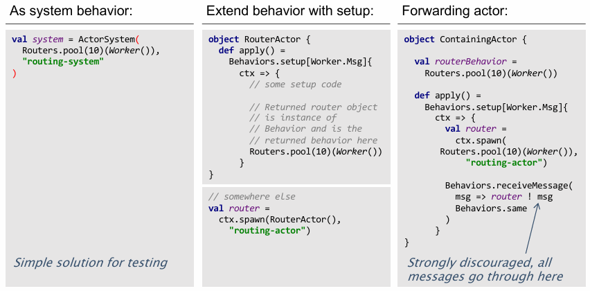

# Distributed Computing - summary

## General

### Scala

#### Evaluation Strategies

- Call by value:
  - An expression is reduced to values before the function is called (e.g.: `2 + 3 => 5`)
  - Use when arguments are simple and don't involve complex computations
  - More efficient
  - Scala syntax: `def callByValue(x: Int) {...}`
  - `val` is always call by value
- Call by name:
  - An expression is evaluated every time it is used within the function (e.g.: `2 + 3 => 2 + 3`)
  - Use when the evaluation of an argument should be delayed or might not be used at all
  - Scala syntax: `def callByName(x: => Int) {...}`
  - `def` is always call by name

#### Currying

A curried function is applied to multiple argument lists:

```scala
def multiply(a: Int) : Int => Int = {
  def multiplyInternal(b: Int) = a * b
  multiplyInternal
}

// or 

def multiply(a:Int)(b:Int): Int = {
  a * b
}

// can be called by

multiply(10)(5) // = 50
```

### Von Neumann Bottleneck

The ''von Neumann Bottleneck'' states, that the bottleneck isn't the CPU, but the communication with the memory.



So if you can't have more powerful cores, more cores could solve the problem

#### _PPP (Popular Parallel Programming) Grand Challenge_

As single chip performance curve isn't rising anymore, parallel programming is a must, to increase performance growth.

#### Functional Programming

- Programming style with focus on functions (= _first class citiziens_) & immutable data structures
- Functions can be created, composed, passed as arguments
- Rather than step-by-step instrucitons -> break down problems into smaller problems

### Progamming Styles

- **Parallel Programming**: Execute programs faster on parallel hardware
- **Concurrent Programming**: Manage concurrent execution threads explicitly
- **Distributed Computing**:
Parallell components, concurrent execution threads, on phyisically distributed heterogenous components

#### Examples

- Parallelism:

  - Collections
  - (Parallel) Streams
  - Execution

- Concurrency:

  - Threads
  - Actors
  - Futures

- Distribution:

  - Clustering
  - Sharding
  - Streaming

## ForkJoin Computation

_Divide and Conquer_ problems: Recursively broken down to smaller sub-tasks

### Concepts

#### Work Stealing

- Worker maintains own runnable tasks in scheduling queue, `double-eneded queue` (_dequeue_) supports `LIFO` and `FIFO`
- Worker thrads process own dequeus in `LIFO` order
- When Worker thread doesn't have local tasks to run, it attempts to _steal_ task from other worker, using `FIFO`
- When worker thread has no work and can't steal, it idles until new task is invoked

#### Blocking Operations in Threadpools

- Blocking operations may occupy all working threads
- Threadpool needs to know if operations are blocking
- Managing blocking operations with the use of _wrappers_ (`ManagedBlocker`)

#### Computation Graphs

- **Time(s)**: Execution time of Step $S$
- **Work**: Sum of all _time(s)_ of steps in Computation Graph
- **Span**: Sum of _time(s)_ of _longest path_

Speedup can be $IDEAL\ PARALLELISM = \frac{WORK}{SPAN}$ times faster in parallel.

Speedup is $\frac{T_1}{T_p}$, when $T_1$ is Time on 1 processor vs. $T_p$ is time on $p$ processors.

##### Amdahl's Law



## Reactive Programming / Actors

### The Reactive Manifeso



### Actors



#### Requirements

- never share internal state
- no accessors or public methods
- react to messages received from other actors
- push messages rather than pull
- provide and use non-blocking API
- consume and hold immutable data structures
- supervised in case of failure by parent actor
- only have one operation: `receive`

#### Akka

##### Receive

Actors can receive and handle messages differently:

- Use `receive` when you need both the _context_ and the message.
- Use `receiveMessage` when you only need the message.
- Use `receiveMessagePartial` when you want to handle specific messages _without_ the context.
- Use `receivePartial` when you want to handle specific messages with the _context_.

##### Actor behavior

Actors use the `apply()` method to define a `Behavior`.

```scala
// Stateless Actor.
object FirstActor {
  sealed trait FirstRequest
  case class DoThis(toDoThis: String) extends FirstRequest
  case class DoThat(toDoThat: String) extends FirstRequest

  def apply() : Behavior[FirstRequest] = Behaviors.receiveMessage(
    message => {
      message match {
        case DoThis(toDo) => 
          println(s"Doing this now: $toDo")
          // + send reply 
        case DoThat(toDo) => 
          println(s"Doing that now: $toDo")
          // + send reply
      }
      Behaviors.same
    }
  )
}

// Stateful Actor -> persists state across many messages sent.
object StatefulActor {
  sealed trait Message
  case class Increment(by:Int) extends Message
  case object PrintValue extends Message
 
  // On Actor spawn: CounterBehavior is initialized.
  def apply() : Behavior[Message] = newCounterBehavior(0)
  
  private def newCounterBehavior(counter:Int) : Behavior[Message] =
    Behaviors.receiveMessage(
      message => message match {
        case Increment(by) => 
          // On `Increment` message received: recursive call.
          newCounterBehavior(counter + by)
        case PrintValue => 
          println(counter)
          Behaviors.same // Forward message to spawned actor.
    }
  )
}
```

##### Actor spawning and sending messages

Actor system must have a behavior itself. It:

- initializes the system by spawning all needed actors.
- reacts to messages coming from outside the actor system, forwards messages internally.

```scala
// Telling Actor, just setting up a ActorSystem and sending message
object CreatingActor {
  def apply() : Behavior[Any] = Behaviors.setup(
    context =>
      // Spawn new actor.
      val actorCreated = context.spawn(XActor(), "actor-name")

      // Send message to actor = "Tell"
      // `context.self` can be used as ActorRef, so that the receiving Actor can answer 
      //    -> `receive` function must be implemented in spawning actor.
      actorCreated ! SomeMessage("xyz", context.self)

      Behaviors.ignore
  )

  ActorSystem(CreatingActor(), "creating-actor-system")
}

// Asking Actor, asking actor and react to resposne
object AskingActor {
  sealed trait AskinCommand
  final case class Ask(forName: String) extends AskingCommand
  private final case class AdaptedCreditWorthiness(name: String, score: Int) extends AskingCommand

  def apply(creditActor: ActorRef[CreditActor.CheckCreditWorthiness]): Behavior [AskingCommand] =
    Behaviors.setup(
      context => {
        implicit val timeout = Timeout(5 seconds) // implicitly declare Timeout

        Behaviors.receiveMessage {
          case Ask(name) =>
            context.ask(creditActor, ref => CreditActor.CheckCreditWorthiness(name, ref))(
              response => response match {
                case Success(worthiness) => // Answer from creditActor
                  AdaptedCreditWorthiness(name, worthiness.score) // score is name of input var in creditActor response
                case Failure(ex) => // In case of no response given after Timeout
                  AdaptedCreditWorthiness(ex.getMessage, -1) // Failure action
              }
            )
            Behaviors.same
          case AdaptedCreditWorthiness(name, score) =>
            // handle answer
            Behaviors.same
        }
      }
    )
}
```

###### Futures

Futures are available at some point, but not at the moment.
They can be resolved `onComplete`, either with a `Some[T]` (in case of success) or `None` (in case of failure).
Futures always need an implicit `ExecutionContext`.

`Asking` and actor always produces a `Future`, that needs to be resolved.

To resolve a `Future`, they can be included in the function `pipeToSelf`,
so they are resolved regardless of the current worker thread.

###### Dispatchers

Akka has a global dispatcher, that implements a `ForkJoinPool`.
Different dispatchers could be assigned to actors, or group of actors.

### Clustering

#### Terminology

- **Node**: logical member of a cluster
- **Cluster**: Set of nodes, joined together
- **Leader**: Single node in the cluster, acts as leader, managing cluster convergence

#### Clustering Tools

- **Work distribution**: Cluster aware routing and load balancing
- **Sharding**: Group actors into `shards` over nodes, shards can move between nodes
- **Distributed Publish-Subscribe**: Topic-based messaging between actors in cluster
- **Distributed Data**: Key-Value type data storage
- **Singleton**: Exactly one instance of a specified actor type
- **Client**: External accessors
- **Metrics**: Live cluster halth and performance for administration
- **Reliable Delivery**: Delivery and flow control of messages

For stateless actors, it's called `Clustering`, for stateful actors `Sharding`.



##### Cluster Singleton

The cluster has to assure, that there is only on instance of a given actor in the cluster.
This pattern is only used with special use cases.
Singleton might be moved between nodes over its lifecycle.

##### Cluster Sharding

Only makes sense with stateful actors -> Subset of actors is evenly distributed over more than one node.

#### Receptionist

The `Receptionist` in the Actor System provides an API to retreive `ActorRef`s.
Actors can subscribe to the `Receptionist`, to get a list of registered services.

```scala
Reciptionist.Register(serviceKey, replyTo) // To register a serviceKey.
Receptionist.Find(serviceKey, replyTo) // To find a registered service.
Receptionist.Subscribe(serviceKey, replyTo) // To subscribe to a registered service.

Receptionist.Listing(listing) // Message adapter for actors that receive replies from the Receptionist.
```

To subscribe to an actor, registered in the `Receptionist`:

```scala
object ActorInReceptionist {
  final case class ActorMessage(...)

  // Provide ServiceKey for other actors.
  val ActorServiceKey = ServiceKey[ActorMessage]("actor-in-receptionist")

  def apply() = Behaviors.setup {
    context =>
      // Register actor in receptionist on spawn.
      context.system.receptionist ! Receptionist.Register(ActorServiceKey, context.self)
  }
}

object ClusterActor {
  def apply() = Behaviors.setup {
    context =>
      // Spawn Actor in cluster.
      val actorInReceptionist = context.spawn(ActorInReceptionist(), "actor-in-receptionist")

      ...
  }
}

object SubscribingActor {
  // Message type for adapter.
  final case class SubscribingActorMessage(listing: Receptionist.Listing)

  def apply() = Behaviors.setup {
    context =>
      // Get message adapter and handle listing.
      val adapater = context.messageAdapter((listing: ReceptionistListing) => SubscribingActorMessage(listing))

      // Subscribe to actor.
      context.system.receptionist ! Receptionist.Subscribe(ActorInReceptionist.ActorServiceKey, adapter)

      Behaviors.onMessage {
        case SubscribingActorMessage(listing) =>
          // Send message to subscribed actor.
          listing.serviceInstances(ActorInReceptionist.ActorServiceKey) ! ActorMessage(...) 
      }
  }
}
```

### Event Sourcing and Persistence

To persist the state of an actor at any given time, `EventSourcedBehavior` can be used.
It allows:

- **Complete rebuild**: The state can be rebuilt by replaying the events
- **Temporal query**: The state can be rebuild at any point in time
- **Event replay**: In case of an incorrect past event, the state can be corrected

#### EventSourcedBehavior

Persistent Actors define a dedicated `EventSourcedBehavior`:

```scala
object PersistenActor {
  trait MyMessage
  case class Message1(...)
  case class Message2(...)

  trait MyEvent
  case class Event1(...)
  case class Event2(...)

  case class MyState(id: Int, count: Int, ...)
  
  // Define Event behavior with Id, initial state, command handler and event handler.
  def apply(id: Int) : Behavior[T] = EventSourcedBehavior[MyMessage, MyEvent, MyState] (
    persistenceId = PersistenceId.ofUniqueId(id),
    emptyState = MyState(id, 0, ...),
    commandHandler = myMessageHandler,
    eventHandler = myEventHandler
  )

  // Handle messages and return event.
  private def myMessageHandler(state: MyState, command: MyMessage): Effect[MyEvent, MyState] = {
    command match {
      case Message1(...) =>
        ...
        Effect.persist(Event1(...)) // Persist events to handle them in EventHandler.
      case Message2(...) =>
        ...
        Effect.persist(Event2(...))
    }
  }

  // Handle events, when message is received, return new state.
  // This function is exectued after event is persisted in messageHandler.
  private def myEventHandler(state: MyState, event: MyEvent): MyState = {
    event match {
      case Event1(...) => 
        ...
        state.copy(count = state.count + 1) // Override state values in copy function to update state.
      case Event2(...) => 
        ...
        state.copy(count = state.count - 1)
    }
  }
}
```

- `persistenceId`: internal primary key, generated from unique id in the actor.
- `emptyState`: The state has to be encapsulated in a dedicated type.
- `commandHandler`: Function, that deals with incoming messages. `(State, Command) => Effect[Event, State]`
- `eventHandler`: Function, that deals with incoming events. `(State, Event) => State`

The state can be stored in snapshots, that can be used to store the value and replay events from that point onwards.
To use the snapshot, the function `EventSourcedBehavior[...](...).snapshotWhen{...}` has to be defined.
Also there is the option to additionally create snapshots after every number of events,
by defining the function `(...).withRetention(RetentionCriteria.snapshotEvery(numberOfEvents = X)`

### Supervision

Supervision allows seperation of concerns:

- **Business level problems**: Handled by actor, by sending corresponding messages
- **Technical level problems**: Propagated to supervision behavior, with strategy (e.g. restart / replace actor, ...)

```scala
object SupervisorActor {
  def apply(...) : Behavior[Any] = Behaviors.setup {
    context =>
      // Supervise spawned actor to react to failures / exceptions within the actor execution.
      val childRef = context.spawn(Behaviors.supervise(ChildActor())
            .onFailure[ExceptionT](SupervisorStrategy.restart // Possible to react to different Exceptions differently.
              .withLimit(maxNrOfRetries = 5) // Stop after retry limit reached.
              .withStopChildren(false) // Children of affected actor won't get restarted.
            ),
        "actor-name"
      )
  }
}
```

#### Supervision strategies

- restart: Message that caused failure is ignored, failed actor instance is replaced by new instance
- resume: Message that caused failure is ingored, failed actor instance is resumed from suspension
- stop: actor instance will be permanently stopped without resuming or replacing instance
