# Software Testing - Summer 2024

## Software Testing Process

### Steps

1. **Analysis**: Analyze specification and software implementation
1. **Identify Test Coverage Items**: Criteria the tests address
1. **Identify Test Cases**: Specify data required to address test coverage items (TCI)
1. **Test Design Verification**: Review test cases to ensure every TCI has been covered
1. **Test Implementation**: Implement using test tool library
1. **Test Execution**: Execute tests using selected input data values
1. **Review Test Results**: Examine test results for failures

### Test Cases Template

| ID  | TCI  | Inputs (multiple columns) | Expected Results (return value) |
| --- | ---- | ------------------------- | ------------------------------- |
| ID  | List | Values                    | Values                          |

> For error values the ID and the error value get marked with a \*

## Black Box Testing

Testing for specification: does the tested code generate correct results?

### Equivalence Partitions

1. **Analysis**: Identify natural ranges & specification-based ranges
   (Specification-based ranges declare which range changes the result)
1. **Identify Test Coverage Items**: TCI for each partition of each input / output parameter
1. **Equivalence Value for each TCI**: Identify middle value of short ranges or convenient value for long ranges
1. **Identify Test Cases**: Select first uncovered TCI,
   indicate [duplicates] when all TCIs of input are covered or result is already covered,
   last Test Cases cover error partitions, indicated with \*
1. **Test Design Verification**: Check if all TCIs are covered

#### Examples

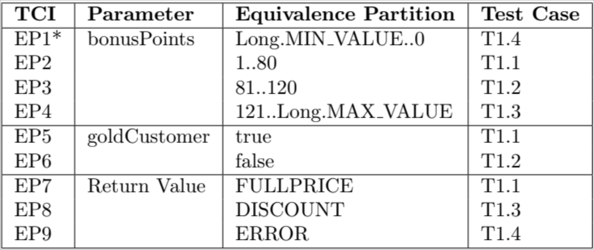

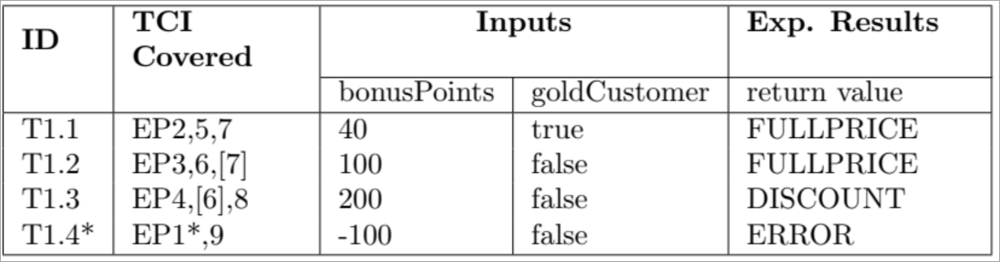

### Boundary Value Analysis

1. **Analysis**: Same as with EPs
1. **Identify Test Coverage Items**: Each TCI covers one boundary value (min or max)
1. **Identify Test Cases**: Same as with EPs

#### Examples

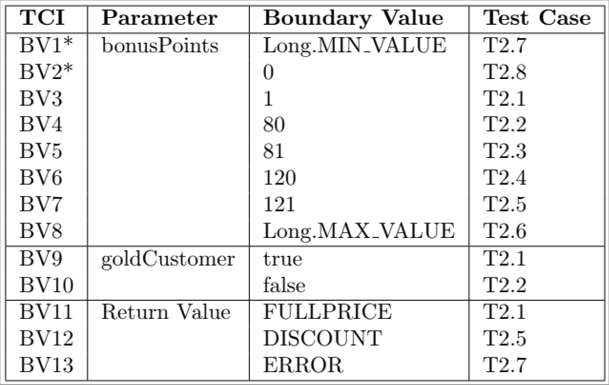

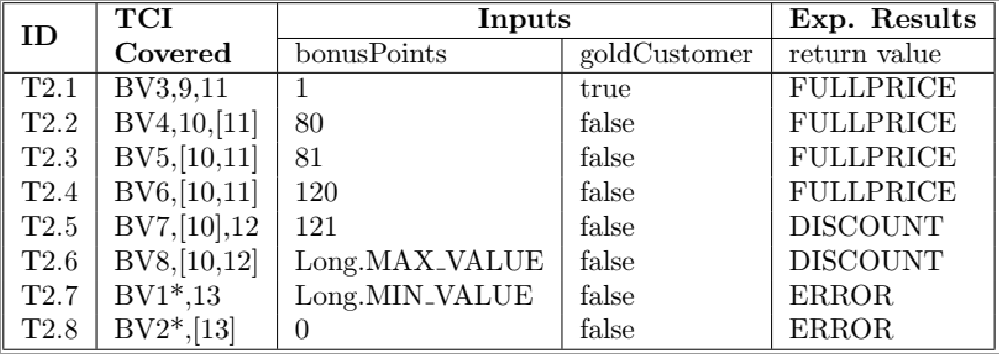

### Decision Table

1. **Analysis**: Create boolean expressions for each non-error partition
   1. Identify the boolean expressions
   1. Fill decision table
   1. Remove impossible columns
   1. Fill effect / return value
   1. Verify each rule
1. **Identify Test Coverage Items**: Each rule is a TCI
1. **Identify Test Cases**: Each rule has a candidate test case, duplicates get removed
1. **Test Design Verification**: Fill TCI table, check for duplicates, every TC covers at least 1 TCI

### Examples

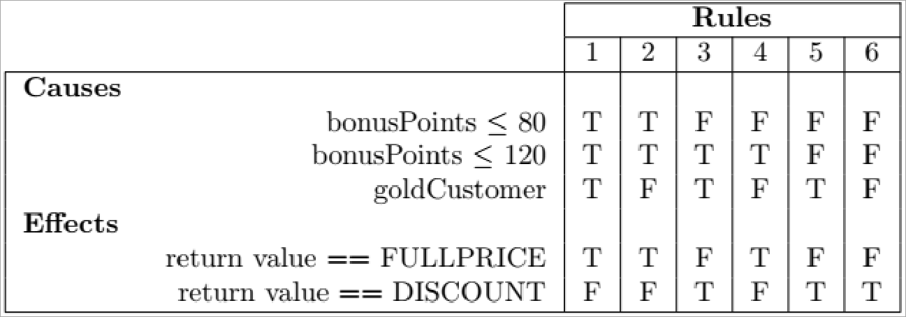

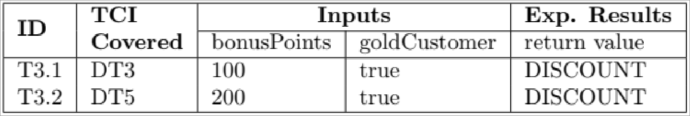

## White Box Testing

Testing the implementation: do valid results get generated when executed?

### Statement Coverage

1. **Analysis**: Run existing tests, check JaCoCo coverage report for missed statements
1. **Identify Test Coverage Items**: Create TCI to reach uncovered statement
1. **Identify Test Cases**: Create TC for every TCI
1. **Test Design Verification**: Complete TCI table, remove duplicates, every TCI must cover at least 1 TC

### Examples

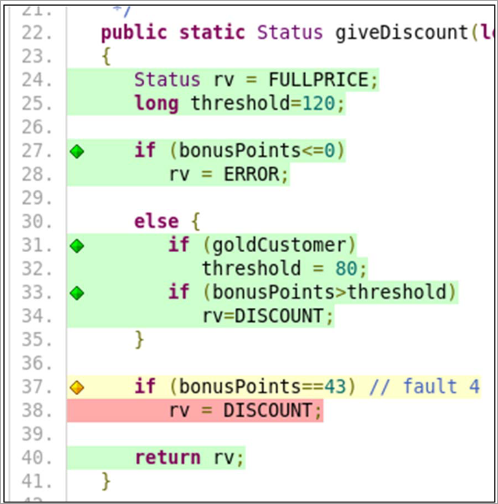

### Branch Coverage

1. **Analysis**: Run existing Tests, check JaCoCo report for missed branches
1. **Continue as with Statement Coverage**

### Examples

> After implementing Statement an Branch Coverage Tests check JaCoCo report!

## Object Oriented Testing

Refers to testing methods in the context of their class, as methods interact with each other.

1. **Analysis**: Categorize class methods, select testing technique
   1. _Static methods_: usually no testing (?)
   1. _Constructors_: Test attribute initialization
   1. _Accessor methods_: Only test if they have more than a single assignment / return statement
   1. _Methods with no class interaction_: Test using non-OO techniques
   1. _Methods with class interaction_: Test all of these
1. **Identify Test Coverage Items**: All methods to test, including in- and outputs and euqivalence partitions
1. **Identify Test Cases**: TC for each TCI, consists of multiple method calls
1. **Test Design Verification**: All TCIs covered, no duplicates

## Examples

### Analysis

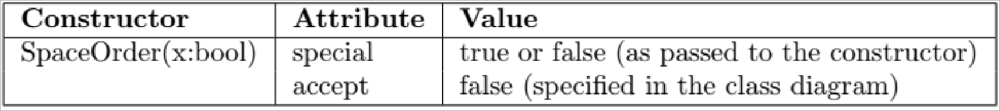
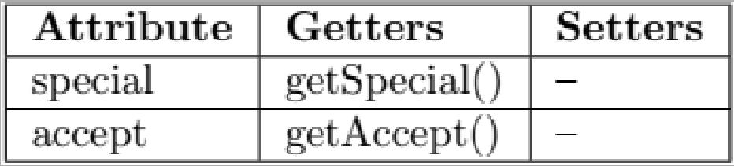
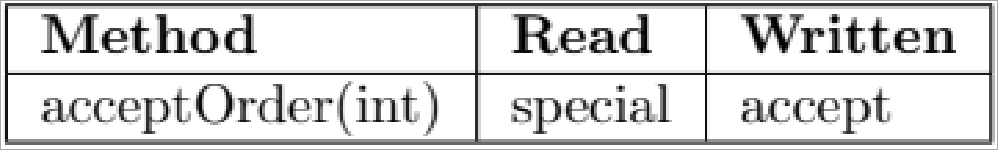

### TCs / TCIs

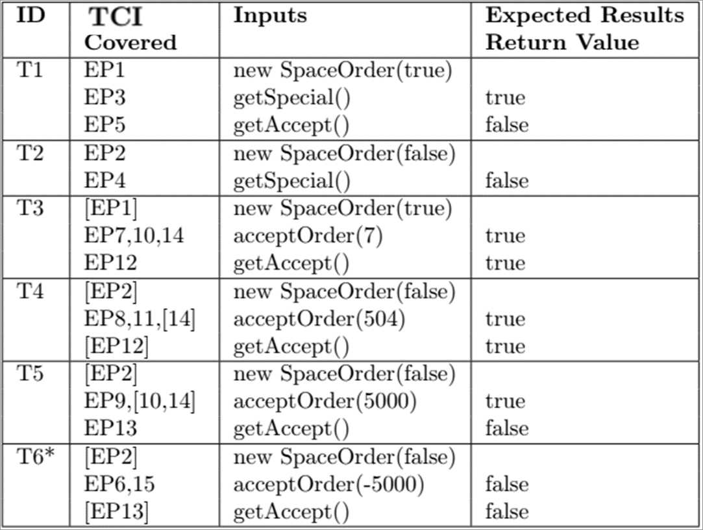

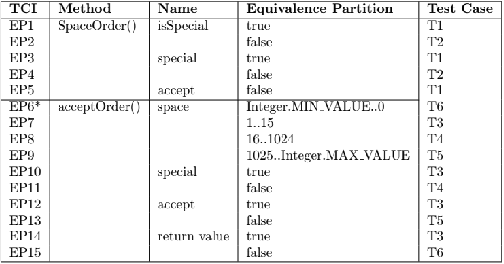

## Application Testing

1. **Analysis**: Identification of site structure
   1. Analyze different screens
   1. Analyze user interface elements on each screen
   1. Analyze how input and output data is represented
1. **Identify Test Coverage Items**: Each user story with each acceptance criterion, select suitable values
1. **Identify Test Cases**: each TCI has one TC that checks the output
1. **Test Design Verification**: Review each test case to its user story / acceptance criterion
1. **Test Implementation**: Something like Selenium can be used for web app interaction

### Analysis

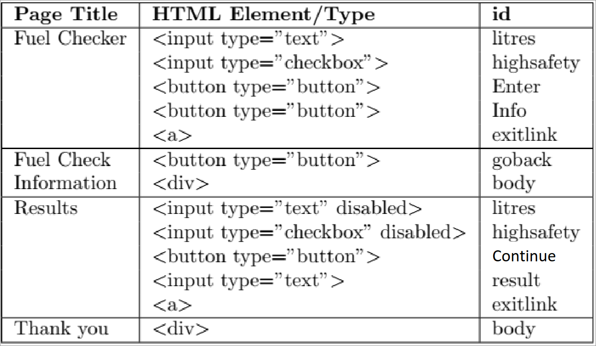

### TCs / TCIs

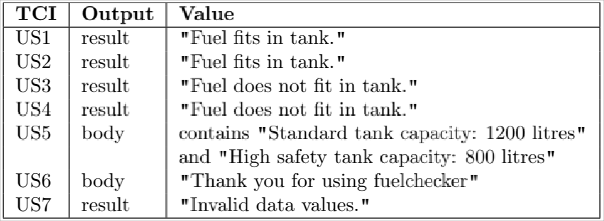
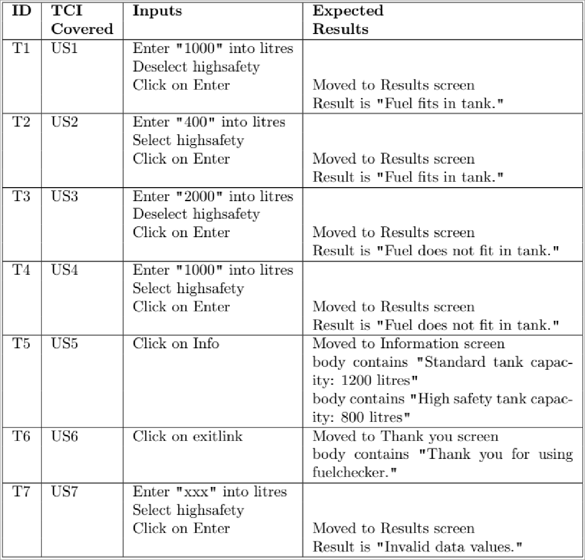

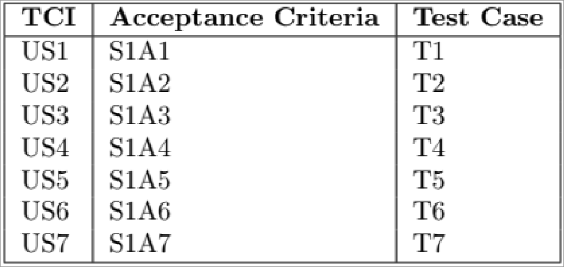
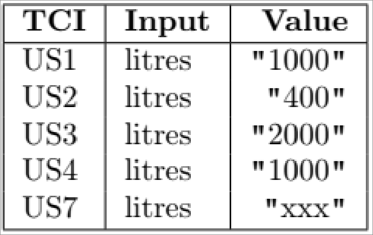

## Test Automation

Can be achived through different frameworks.
Usually tests get run on every pull / merge request through the use of a CI pipeline.

## Path Testing

1. **Analysis**: Identify all possible paths through the application, remove logically impossible paths
1. **Test Cases and Coverage Items as in other black- and whitebox testing techniques**

## Random testing

A large number of inputs gets selected randomly, approximates to exhausive testing.
Exercises program, demonstrates that it does not crash.

3 Problems:

- **Test Completion Problem**: No information on how many tests are needed
- **Test Data Problem**: Poor distribution of inputs, as it doesn't respect partitions
- **Test Oracle Problem**: Can't tell if results are correct -> too many test

Proceed as with Equivalence Partitions, but take random values for partitions:

1. **Identify Test Cases**: Random input between boundaries of value

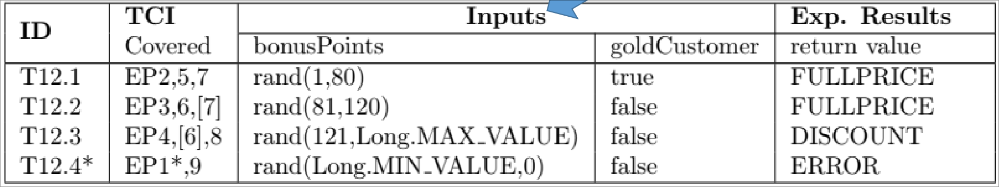

1. **Test Design Verification**: If test fails, break and report error
