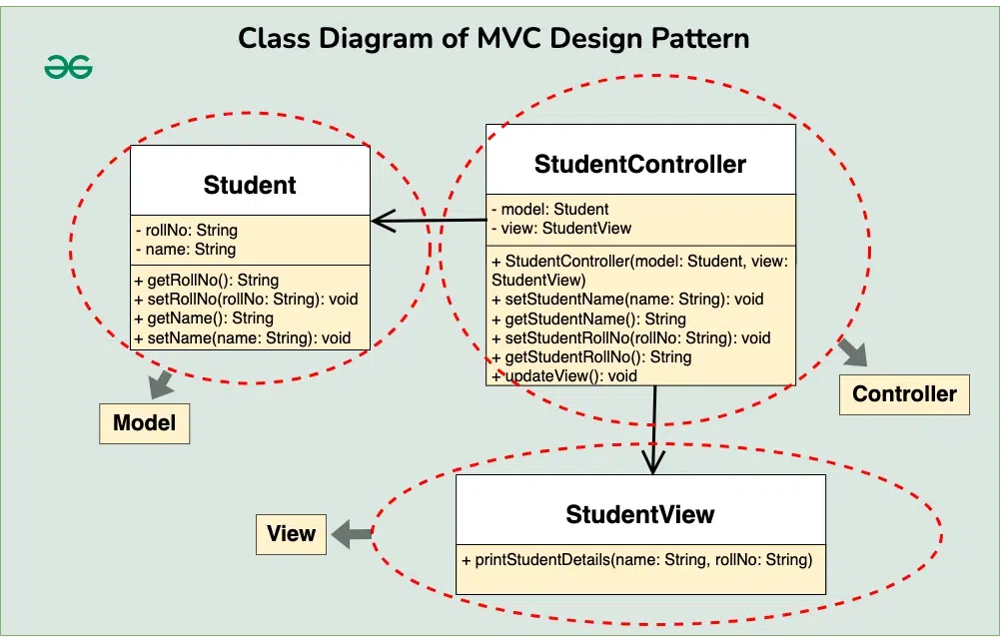
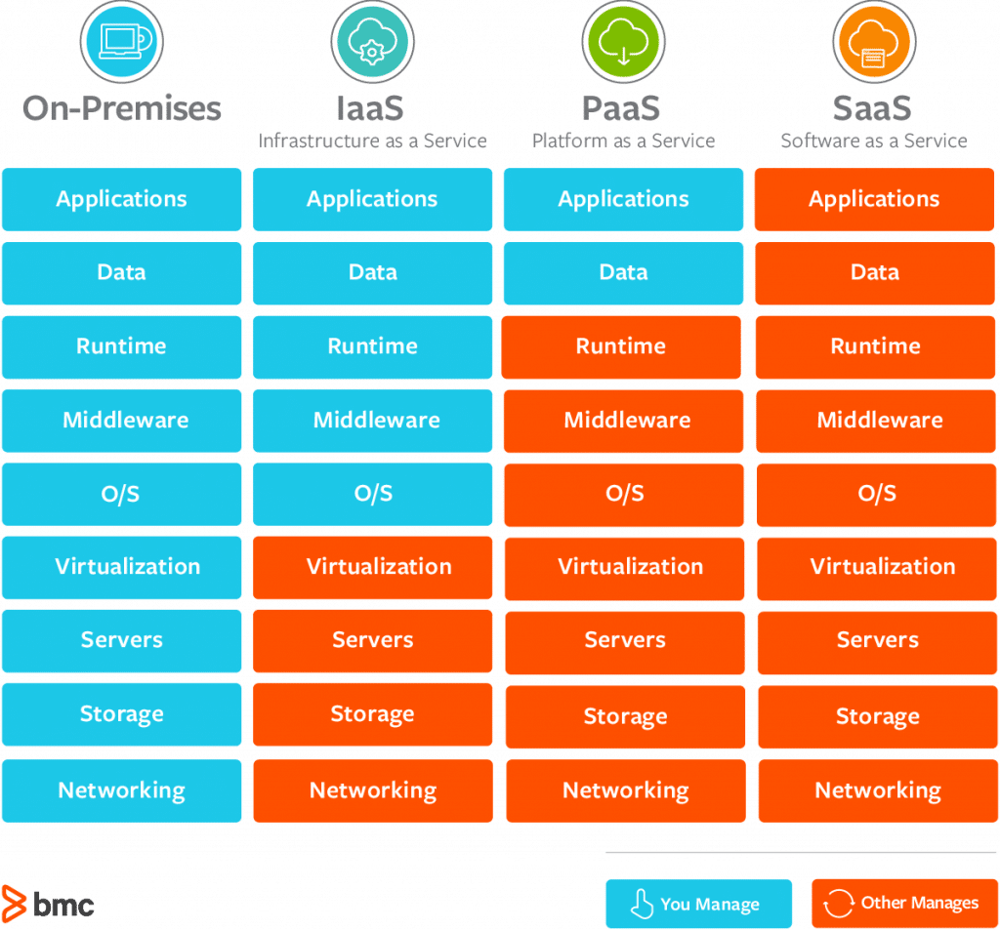

# Summary - CS615 - Internet Solutions Engineering

## History of HTTP

1. **HTTP 1.0**
   Only allowed GET requests. Each request requries a new TCP connection to be established and closed.
1. **HTTP 1.1**
   Allowed multiple request types, like GET, PUT, POST, DELETE. Slower than 1.0.
   TCP connection is remained alive for multiple requests / responses.
1. **HTTP 2.0**
   Introduces features like multiplexing, where multiple requests can be sent without waiting for responses.
   Introduces Header-compressing.
1. **HTTP 3.0**
   Native, improved multiplexing and built-in encryption.
   Fastest & most secure HTTP, but less supported than 2.0.

## Model-View-Controller

Model-View-Controller is a design pattern used in software engineering,
seperates concerns of data handling, user-interface and control-logic.




## NoSQL Database

- **Scalability**: NoSQL databases are designed to expand easily to handle large amounts of data and high user loads.
- **Flexibility**: They typically offer flexible schemas that can adapt to the changing requirements of a web project.
- **Performance**: NoSQL databases can provide fast reads and writes for certain types of workloads.
- **Data Model Variety**: Different types of NoSQL databases (document, key-value, columnar, graph)
  allow for specific use-cases (user profiles, real-time analytics, content management, etc.).

## Node.js

- **Non-blocking I/O**: Node.js uses an event-driven architecture capable of asynchronous I/O.
  This makes it very efficient for scalable and real-time applications like live streaming sites.
- **JavaScript Everywhere**: Since Node.js uses JavaScript, developers can use the same language
  for both client-side and server-side development.
- **Large Ecosystem**: Node.js has a large, active open source community and ecosystem
  creating modules and libraries which can be easily included in your projects.
- **Microservices Architecture**: Node.js is a good fit for microservices which are increasingly used
  in web development due to their flexibility and efficiency.

### Callback in Node.js

- A callback is a function passed as an argument to another function in Node.js.
  This technique allows a function to call another function when a task is completed, hence the term ‘callback’.
- Callbacks provide a way to manage asynchronous operations in Node.js,
  such as reading files, making database calls, or making requests over the network.

```js
fs.readFile("example.txt", "utf8", function (err, data) {
  if (err) {
    return console.error(err);
  }
  console.log(data);
});
```

### Express route handler vs express.Router

The _Express route handler_ binds individual endpoints to a function, like GET, POST, DETLETE.

```js
const express = require("express");
const app = express();

// respond with "hello world" when a GET request is made to the homepage
app.get("/", (req, res) => {
  res.send("hello world");
});
```

The _express.Router_ creates a new route handler object, which then takes in a route and binds different functions
to it all at once.

```js
app
  .route("/book")
  .get((req, res) => {
    res.send("Get a random book");
  })
  .post((req, res) => {
    res.send("Add a book");
  })
  .put((req, res) => {
    res.send("Update the book");
  });
```

In summary, while both Express route handlers and express.Router are used for handling routes,
the key difference lies _in their usage_.
**Express route handlers** are directly attached to the Express app and handle routes at the application level.
On the other hand, **express.Router** allows for more modular and flexible handling of routes
by creating a new router object, which can be used to define routes in a more organized manner,
especially for larger applications.

### MERN-Stack

- **M**ongoDB
- **E**xpress application framework
- **R**eact.js
- **N**ode.js

## CSS

### Norman / Schneidermann / Nielsons interface design / usability heuristics

- **Consistency**: Utilize familiar icons, colors, menu hierarchiy, user flows.
- **Shortcuts**: Enable frequent users to use shortcuts, so the can navigate and operate the UI more quickly and effortlessly.
- **Dialogue**: Ensure the user knows where they are at and what is going on.
- **Error handling**: Design the system to have as few errors and possible, and handle occured errors with grace.
- **Permit reversal of actions**: Relive anxiety by letting user know that settings can be undone.
- **Reduce short-term memory load**: Keep display simple, reduice window-motion frequency, don't display multiple pages

### Accessibility

1. **Color contrast**: Ensure that there is a high contrast between foreground and background-color.

   ```css
   body {
     color: #444; /* dark grey */
     background-color: #fff; /* white */
   }
   ```

1. **Font size and scaling**: Use font sizes of relative units, so text can be freely scaled up and down by users.

   ```css
   body {
     font-size: 1rem;
   }
   h1 {
     font-size: 2em; /* twice the size of the body text */
   }
   ```

1. **Focus indicators**: Use focus indicators for easier keyboard-only using of the site.

   ```css
   a:focus,
   button:focus {
     outline: 3px solid #f90; /* orange outline */
   }
   ```

## React.js

**What is React.js?**
React.js, often simply called React, is an open-source JavaScript library for building user interfaces,
particularly single-page applications where you need a fast, interactive user interface.

**Where might it be used?**
React is used in the development of single-page applications and mobile applications.
It's suitable for any project where you want to build a fast, dynamic user interface. Examples include:

- Web applications like Facebook, Instagram, WhatsApp, and Airbnb.
- Mobile applications using React Native, a framework that allows you to write mobile applications
  in JavaScript and still deliver a real native user interface.

**What are its advantages?**

- **Component-Based**: React allows developers to build encapsulated components that manage their own state,
  then compose them to make complex UIs. This makes code reusability and separation of concerns possible.
- **Virtual DOM**: React creates an in-memory data structure cache which computes the changes made
  and then updates the browser.
  This allows a special feature called the diffing algorithm which provides excellent performance.
- **Unidirectional Data Flow**: React implements one-way data flow which makes it easy to reason about your app.
- **Ecosystem**: React has a rich ecosystem of libraries, tools, and extensions, and a very active community.
  This means that as a developer, you have a lot of support and resources at your disposal.
- **JSX**: React uses JSX, a syntax extension for JavaScript, allowing you to write HTML-like syntax
  directly in your JavaScript code.
  It's not required to use React, but it makes the code more readable and writeable.

## Cloud computing



**PaaS** to deploy consumer created or acquired applications, using programming languages
and tools supported by the service provider.

### Security, Privacy, Data Ownership

_Strengths_:

- **Centralized Security**: Cloud computing offers centralized security which means all the applications
  and data are centralized, reducing the likelihood of individual attacks.
- **Data Encryption**: Cloud providers offer data encryption for data at rest and in transit, protecting
  sensitive data from unauthorized access.
- **Regulatory Compliance**: Many cloud providers offer compliance with regulations like GDPR, HIPAA, etc.,
  which can be a significant advantage for businesses in regulated industries.

_Weaknesses_:

- **Data Breaches**: Storing data on the cloud can make it a target for hackers.
  If security measures fail, your data could be exposed.
- **Privacy Concerns**: When data is stored on the cloud, there can be concerns about who has access to this data,
  especially in a multi-tenant cloud environment.
- **Data Ownership**: There can be legal and regulatory concerns about who owns the data once it's on the cloud.
  It's important to understand the cloud provider's policies.

### Cost Efficiency

_Strengths_:

- **Pay-as-you-go Model**: With cloud computing, you only pay for what you use.
  This can lead to significant cost savings compared to maintaining your own infrastructure.
- **Reduced Hardware Costs**: There's no need to invest in expensive hardware and servers.
  The cloud provider takes care of all that.
- **Reduced Maintenance Costs**: You don't need to worry about maintenance, upgrades, or replacing old equipment.

_Weaknesses_:

- **Potential for Unexpected Costs**: While the pay-as-you-go model can save money, if not managed properly,
  costs can also spiral out of control. For example, data transfer costs can add up quickly.
- **Dependence on the Provider**: If the provider increases prices, you may be forced to either pay more or
  go through the difficult process of switching providers.
- **Cost of Data Migration**: There can be significant costs associated with moving data to (or away from) the cloud,
  especially if you have large amounts of data.

## Website visibility - Search engine optimization

**Search Engine Optimization (SEO)** is the process of improving your website to increase its visibility
in search engines like Google, Microsoft Bing, and others.
The better visibility your pages have in search results, the more likely you are to be found and clicked on.
SEO involves making changes that are beneficial to a site's visitors.
It's about fulfilling users' search needs by creating relevant, high-quality content and providing
the best possible user experience.
The ultimate goal of SEO is to help attract website visitors who will become customers,
clients, or an audience that keeps coming back.

### White-Hat SEO and Black-Hat SEO

**White-Hat SEO** refers to ethical strategies that use valuable content and user-centered tactics
to raise a website's position in search results.
It follows search engine guidelines, focuses on a human audience, and takes a long-term approach.
For example, it includes offering quality content and services, fast site loading times,
mobile-friendliness, using descriptive, keyword-rich meta tags, and making your site easy to navigate.

On the other hand, **Black-Hat SEO** refers to a set of practices that are used to increase a site or page's rank
in search engines through means that violate the search engine's terms of service.
It uses aggressive tactics aimed at manipulating search engine algorithms.
For example, it includes content automation, doorway pages, hidden text or links,
keyword stuffing, and reporting a competitor (or negative SEO).

### White-Hat SEO advices

1. **Quality Content**: Create relevant, engaging, and high-quality content that provides value to your audience.
   This can help attract and retain users, and search engines will recognize this value.

2. **Keyword Research**: Identify and use keywords that your target audience is searching for.
   Incorporate these keywords naturally into your content.

3. **Mobile-Friendly Design**: Ensure your website is responsive and user-friendly on all devices, especially mobiles,
   as search engines favor mobile-friendly sites.

4. **Site Speed**: Improve your website's loading speed.
   A faster site provides a better user experience and is favored by search engines.

## Website security

1. **SQL-Injection**: Attacker tries to interfere with the queries an app makes to its database.
   Usually occures in user inputs, that are not validated or encoded by the app.
   _Example_: Attacker inputs a value like `1' OR '1'='1` into a vulnerable login form.
   This modifiees the SQL query to return all users.
   _Prevention_:

   1. Use prepared statements
   1. Use stored procedures
   1. Escape all user supplied input

1. **Cross-Site Scripting (XSS)**: XSS is a vulnerability, where the attacker can inject script code
   into webpages viewed by other users.
   It compromises the interactes that users have with the application.
   _Example_: An attacker might post a comment on a website that includes a script tag with malicious JavaScript.
   When other users view that comment, their browsers execute the malicious script.
   _Prevention_:

   1. Sanitize data to ensure it does not contain harmful scripst before displaying / storing it.
   1. Use content security policies
   1. Secure cookies to prevent them from being accessed by client-side scripts
